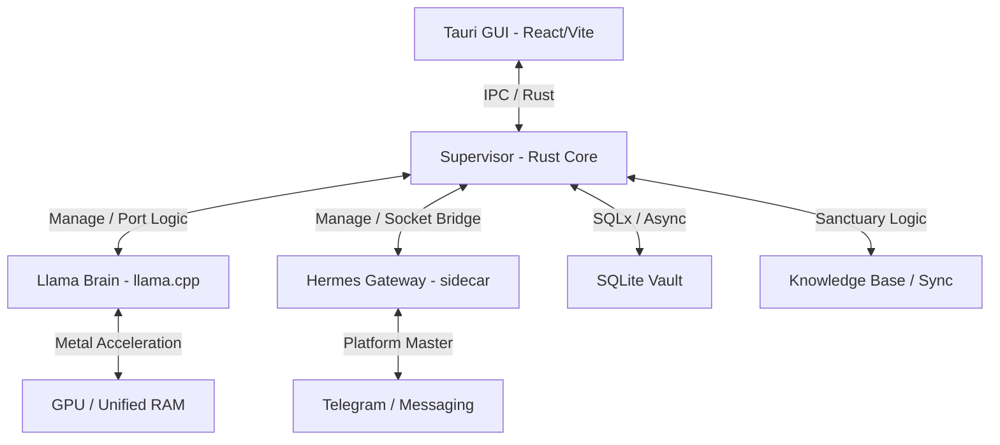

# ✹ OPERARIUS: THE DEEP-DIVE MANIFEST
> **A Master-Class in Local Silicon Orchestration.**

Operarius is a high-performance, private AI orchestrator designed to transform Apple Silicon into a sovereign neural hub. This manifest details the architectural decisions, process lifecycles, and engineering protocols that make Operarius the most stable and private local intelligence platform.

---

## 🏗️ Architectural Overview

Operarius operates as a **Monolithic Process Supervisor**. Unlike basic LLM wrappers, it manages a fleet of specialized sub-processes through a safety-critical Rust core.

---

## 🛡️ The "Triple Lock" Process Protocol

### 1. The Supervisor (The Heartbeat)
Located in `src-tauri/src/services/supervisor.rs`, the Supervisor is responsible for the **Deterministic Startup Sequence**.
- **Port Cleansing**: Before ignite, it performs a hardware-level `TcpListener` check on ports **8080** and **8989**. If a zombie process is detected, it performs a surgical `pkill` to ensure port sovereignty.
- **Conscious State Polling**: It doesn't allow the Gateway to start until the Llama Brain is "Conscious" (responding with `200 OK` on its health endpoint).

### 2. The Llama Brain (Neural Compute)
Optimized for **Llama 3.2**-class models utilizing GGUF format via Metal.
- **Memory Math**: We implement the **"Golden Threshold"** at **65,536 tokens**. This allocates approx. **7GB of KV cache**, leaving comfortable headroom for the 2.2GB model weights and 6GB of system overhead on a 16GB machine.
- **KV Cache Anchoring**: Using `--keep 1024`, the supervisor "pins" the system prompt and operational instructions into the GPU memory permanently, resulting in near-zero latency for subsequent greetings.

### 3. The Runtime Sanctuary (File Isolation)
To solve the "Infinite Build Loop" in Tauri dev mode, Operarius implements a **Sanctuary Protocol** in `setup.rs`:
- It mirrors the bundled Hermes binary and virtual environment into `~/Documents/Operarius/runtime`.
- It redirects all process management to this isolated sanctuary, ensuring that file writes (logs, caches) never trigger the Tauri file watcher.

---

## 🧠 Intelligence Strategy: RAG v2

We implement a **Deterministic Retrieval Protocol** to solve "Context Flooding":

1. **Semantic Intent Gating**: In `commands.rs`, 100% of user queries pass through a chitchat detector. Simple greetings bypass the RAG pipeline entirely, staying in the sub-second response domain.
2. **Context Guillotine**: The Hermes gateway manifest enforces a strict `context: max_tokens: 4096` cap and `max_results: 3`. Even if your knowledge folder contains gigabytes of data, only the most surgical "Signal" enters the brain.
3. **Identity Resonance**: The system prompt is bit-perfectly synchronized across all entry points, ensuring a **100% KV cache hit rate**.

---

## 🗄️ Persistence & Privacy

- **SQLite Vault**: Secrets (Telegram tokens, Auth keys) are stored via `sqlx` in a local SQLite database at `~/Documents/Operarius/db`.
- **Stateless Intelligence**: The Llama process remains stateless; conversation history is handled by the orchestrator and injected only when relevant, preventing historical noise from degrading model performance.
- **Local Sovereignty**: Zero external telemetry. The only outgoing connections are to the Telegram API (if enabled) and HuggingFace (during the initial resumable model download).

---

## 🛠️ Build & Development

| Component | Target | Tooling |
| :--- | :--- | :--- |
| **Backend** | `aarch64-apple-darwin` | Rust 1.75+, Cargo, Tauri v2 |
| **Frontend** | Browser / Webview | React, TypeScript, Vite, Tailwind CSS |
| **Sidecars** | Llama / Hermes | C++ / Python (Nuitka Compiled) |
| **Database** | SQLite 3 | SQLx (Async Runtime) |

### Resumable Downloader (`downloader.rs`)
Our custom downloader supports **Range-based resuming**. If your internet drops during a 5GB model download, Operarius will pick up exactly where it left off, verifying bytes via `metadata().len()`.

---

## 🌌 Future Trajectory

Operarius is evolving toward **Multi-Agent Tool Delegation**. By extending the Hermes manifesting system, we will soon allow the local brain to intelligently spawn specialized "Skill Containers" to handle complex tasks like web-scraping, code execution, and dynamic scheduling.

---

  <b>Built for the Sovereign Citizen | Private. Powerful. Local.</b>

